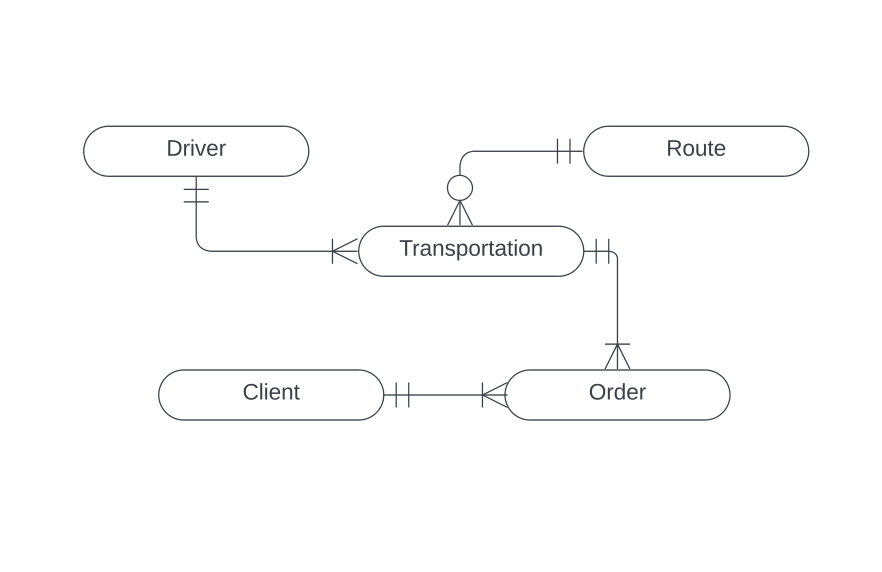
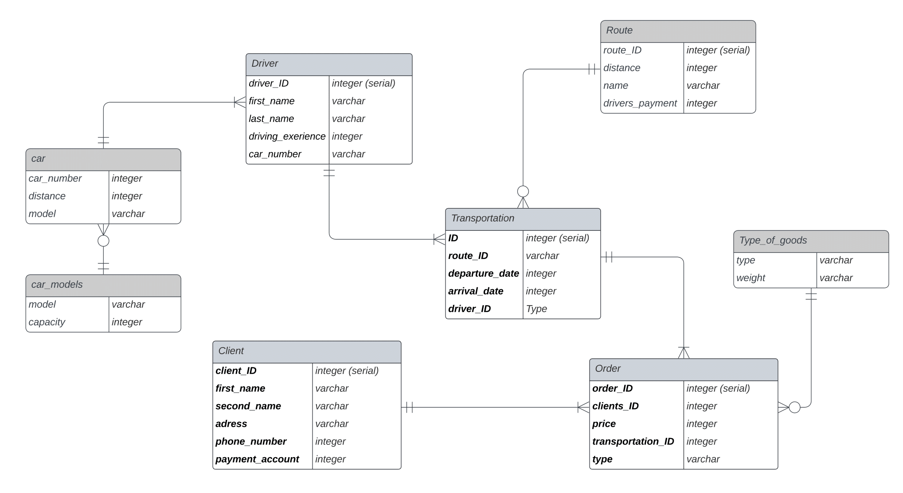
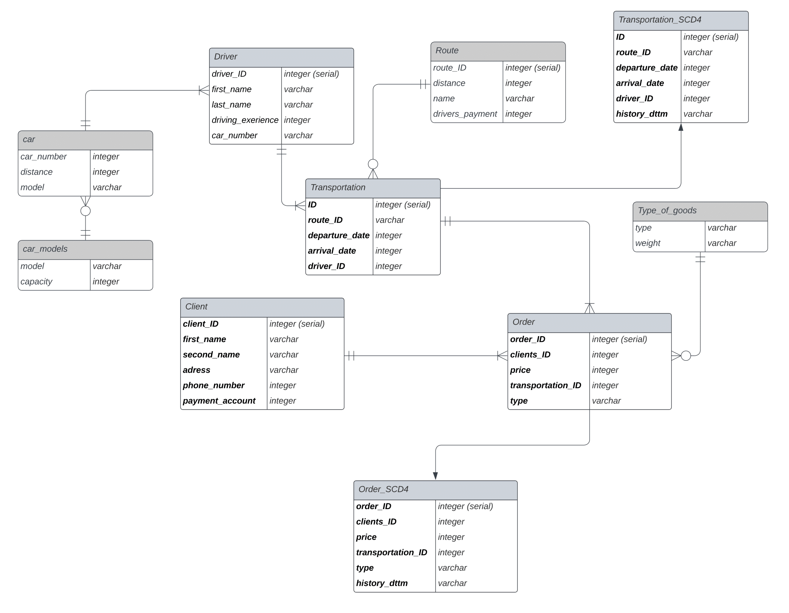

# Курсовой проект по БД: Грузовые перевозки

Проект будет предствалять собой базу данных компании занимающейся
перевозками грузов (сильно упрощенную бд). Перевозки осуществляются
по различным маршрутами. Для каждого определено некоторое название,
примерное расстояние и установлена некоторая оплата для водителя. Ин-
формация о водителях включает фамилию, имя, отчество, автомобиль и
стаж. Информация о каждой перевозке сохраняется (маршрут, водитель,
даты отправки и прибытия). В одной перевозке могут транспортироваться
несколько заказов. Для каждого заказа хранится информация о ее перевоз-
ки, клиент, сделавшего этот заказ, ее номер, тип и цена. Также хранится
информация и о клиентах. Итого сущности проекта таковы: клиент(client),
заказ (order), перевозка (transportation), водитель (driver), маршрут (route).

## Концептуальная модель.

Так как автомобили принадлежат компании и при этом могут
экплуатироваться несколькими водителями за период своей службы, то
выделяем сущность автомобиль. Также стоит учесть что у каждого
автомобиля будет характеристики - грузоподъемность и марка, но
грузоподъемность зависит только лишь от марки, следовательно
выделяем сущность марка автомобиля. Далее проблемы могут возникнуть
с типом заказа - какие-то типы могут вообще не испоьзоваться до какого
момента времени и тд следовательно выделяем сущность тип. База будет
в 2НФ. Почему? Цена за заказ также будет зависеть и от типа груза, а
выделять еще сущности нецелесообразно (и вообще наврядли поможет)
поэтому бд не может быть в 3НФ.

### Логическая модель.

[Ссылка](https://docs.google.com/spreadsheets/d/1X9jyAydatb_6iIskrzATLx-m3K28-qiM5D2H0ZigUR4/edit?usp=sharing)
        на гугл док с физической моделью.
По запросам, в дальнейшем можно будет реализовать запросы дающие
информацию по стоимости перевозок и прибыли, выделить лучших
водителей (чтобы дать им премии), самых крупных клиентов и тому
подобное.
Для этого будем сохранять данные заказов и перевозок. Как мне кажется
логичнее будет сохранить все в табличку типа SCD 4 так как во первых не
вижу смысла сохранять активные перевозки в одной табличке с историей
перевозок, а во вторых таким образом будет легче реализовывать запросы
(тк они в основном будут по выполненным заказам/перевозкам в течение
какого то промежутка времени).
#### Логическая модель + История.

